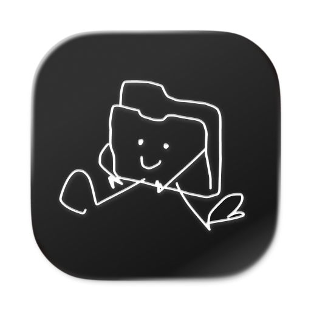

<p align="center">
  
</p>

<h1 align="center">Porty McFolio</h1>

<p align="center">
  <em>A local-first, file-over-app creative portfolio manager for macOS.</em>
</p>

---

Porty McFolio turns a folder of markdown files and media into a fast, browsable portfolio. Your work lives as plain files you own — Porty just renders, indexes, and helps you edit them. No accounts, no cloud, no lock-in.

## Why

Most portfolio tools want to host your work. Porty doesn't. Each project is a folder; each project's content is a markdown file with YAML frontmatter; each piece of media is just a file alongside it. Open the folder in Finder. Sync it with anything. Edit in any text editor. Porty is one possible interface to your portfolio — not the gatekeeper of it.

## Features

- **Six view modes** per project — Editor, Preview, Editor+Gallery, Editor+List, Editor+Links, Carousel
- **Universal search** (⌘K) — full-text across titles, content, file names, and links
- **Three themes** — Porty (default), OSX, B&W
- **Native markdown editor** with syntax highlighting, inline media embeds, and auto-save
- **Rendered preview** with rich embeds (images, video, audio, links)
- **Drag-and-drop and clipboard paste** for media
- **Project list** in grid or table mode, with sorting, filtering, and CSV export
- **Per-project settings** — title, date range, client, tags, status, favorites
- **Keyboard navigation** throughout
- **Welcome and in-project primers** for first-time use
- **Sandboxed** with secure file bookmarks for portable folder paths

## How portfolios are stored

```
your-portfolio/
├── 2026_my-rebrand-project_a1b2c3d4/
│   ├── 2026_my-rebrand-project_a1b2c3d4.md   # frontmatter + markdown body
│   ├── hero.jpg
│   ├── process-shot.png
│   └── final-deck.pdf
└── 2025_another-project_e5f6g7h8/
    └── README.md
```

Each project folder is named `{year}_{slug}_{uid}`. The `.md` file inside contains YAML frontmatter (title, dates, client, tags, status, favorites) followed by the markdown body. That's the whole format.

## Install

Pre-built releases will be available shortly via [Amore](https://amore.computer). For now, build from source.

## Building from source

Requirements: macOS 15+, Xcode 16+, [XcodeGen](https://github.com/yonaskolb/XcodeGen).

```sh
brew install xcodegen
git clone https://github.com/moldandyeast/porty-mcfolio.git
cd porty-mcfolio
xcodegen generate
open PortyMcFolio.xcodeproj
```

Then ⌘R in Xcode.

A signed and notarized DMG can be produced via [`scripts/build-dmg.sh`](scripts/build-dmg.sh) — see the script header for required keychain setup.

## Contributing

Design intent and implementation plans live in [`docs/superpowers/`](docs/superpowers/) — those documents capture the reasoning behind each feature and are the best context for proposing changes.

Tests are in [`PortyMcFolioTests/`](PortyMcFolioTests/) and cover services and models (no SwiftUI view tests by convention).

## License

Apache License 2.0 — see [LICENSE](LICENSE).
